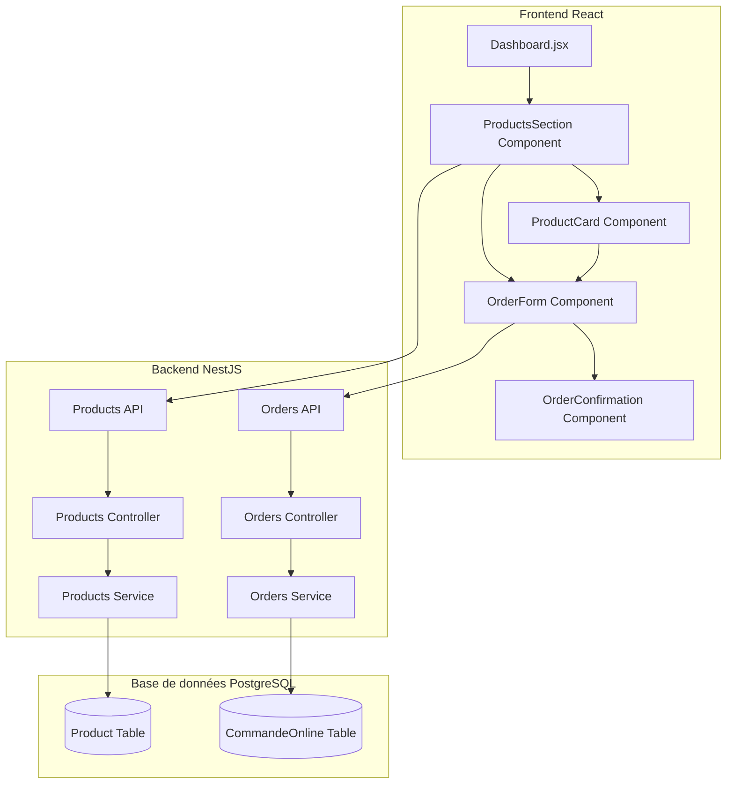

# Document de Conception

## Vue d'ensemble

Cette fonctionnalité ajoute une section "Mes Produits" à la page d'accueil du CRM existant, permettant aux clients de consulter et commander des produits directement depuis l'interface principale. La conception s'intègre parfaitement avec l'architecture React/NestJS existante et utilise les API backend déjà en place.

## Architecture

### Architecture Globale



### Intégration avec l'Architecture Existante

La fonctionnalité s'intègre dans le composant `Dashboard.jsx` existant en ajoutant une nouvelle section après les graphiques. Elle utilise :

- **API existantes** : `/api/products` et `/api/commande-online`
- **Patterns React** : Hooks, Context API, composants fonctionnels
- **Système de design** : Classes CSS existantes, gradients, ombres
- **Gestion d'état** : useState, useEffect pour la synchronisation temps réel
- **Service API** : Le service `api.js` existant pour les appels HTTP

## Composants et Interfaces

### 1. ProductsSection Component

**Responsabilité** : Composant principal qui gère l'affichage de la section produits

```typescript
interface ProductsSectionProps {
  className?: string;
}

interface ProductsSectionState {
  products: Product[];
  loading: boolean;
  error: string | null;
}
```

**Fonctionnalités** :
- Récupération des produits via `/api/products`
- Gestion du loading et des erreurs
- Mise à jour temps réel via polling ou WebSocket
- Responsive design avec grille adaptative

### 2. ProductCard Component

**Responsabilité** : Affichage individuel d'un produit avec ses informations

```typescript
interface ProductCardProps {
  product: Product;
  onOrderSubmit: (order: OrderData) => void;
}

interface Product {
  id: string;
  name: string;
  description: string;
  price: number;
  stock: number;
  image?: string;
  category?: string;
  isActive: boolean;
}
```

**Fonctionnalités** :
- Affichage des informations produit
- Intégration du formulaire de commande
- Gestion de l'état de stock
- Design cohérent avec le système existant

### 3. OrderForm Component

**Responsabilité** : Formulaire de commande intégré dans chaque carte produit

```typescript
interface OrderFormProps {
  product: Product;
  onSubmit: (order: OrderData) => void;
  disabled?: boolean;
}

interface OrderData {
  productId: string;
  quantity: number;
  totalPrice: number;
  customerInfo?: CustomerInfo;
}

interface CustomerInfo {
  name: string;
  email: string;
  phone?: string;
}
```

**Fonctionnalités** :
- Sélection de quantité avec validation
- Calcul automatique du prix total
- Validation des données avant soumission
- Gestion des erreurs de validation

### 4. OrderConfirmation Component

**Responsabilité** : Affichage de la confirmation après commande réussie

```typescript
interface OrderConfirmationProps {
  order: OrderData;
  onClose: () => void;
}
```

## Modèles de Données

### Modèle Product (Existant)

```typescript
interface Product {
  id: string;
  name: string;
  description: string;
  price: number;
  stock: number;
  image?: string;
  category?: string;
  isActive: boolean;
  createdAt: Date;
  updatedAt: Date;
}
```

### Modèle CommandeOnline (Existant)

```typescript
interface CommandeOnline {
  id: string;
  productId: string;
  quantity: number;
  totalPrice: number;
  customerName: string;
  customerEmail: string;
  customerPhone?: string;
  status: 'pending' | 'confirmed' | 'cancelled';
  createdAt: Date;
  updatedAt: Date;
}
```

### Extension pour la Synchronisation Temps Réel

```typescript
interface ProductUpdate {
  type: 'create' | 'update' | 'delete';
  productId: string;
  product?: Product;
  timestamp: Date;
}
```

Maintenant, je vais effectuer l'analyse prework des critères d'acceptation pour créer les propriétés de correction.

<function_calls>
<invoke name="prework">
<parameter name="featureName">home-products-ordering
## Propriétés de Correction

*Une propriété est une caractéristique ou un comportement qui doit être vrai dans toutes les exécutions valides d'un système - essentiellement, une déclaration formelle sur ce que le système doit faire. Les propriétés servent de pont entre les spécifications lisibles par l'homme et les garanties de correction vérifiables par machine.*

### Propriété 1: Affichage des Produits Actifs
*Pour toute* liste de produits dans la base de données, seuls les produits avec `isActive = true` doivent apparaître dans la Section_Produits
**Valide : Exigences 1.1**

### Propriété 2: Synchronisation Temps Réel des Produits
*Pour toute* modification de produit (création, mise à jour, suppression) effectuée via l'Interface_Admin, la Section_Produits doit refléter ces changements automatiquement sans rechargement de page
**Valide : Exigences 1.2, 1.3, 4.1, 4.2, 4.3, 4.4**

### Propriété 3: Complétude des Informations Produit
*Pour tout* produit affiché dans la Section_Produits, le rendu doit contenir le nom, la description, le prix et la disponibilité du produit
**Valide : Exigences 1.4**

### Propriété 4: Présence du Formulaire de Commande
*Pour tout* produit affiché dans la Section_Produits, un formulaire de commande intégré doit être présent et fonctionnel
**Valide : Exigences 2.1**

### Propriété 5: Calcul Automatique du Prix Total
*Pour tout* produit et toute quantité sélectionnée, le prix total affiché doit être égal au prix unitaire multiplié par la quantité, et se mettre à jour immédiatement lors des modifications de quantité
**Valide : Exigences 2.2, 3.2**

### Propriété 6: Validation et Enregistrement des Commandes
*Pour toute* commande soumise avec des données valides (produit existant, disponible, quantité en stock), la commande doit être validée, enregistrée dans le Module_Commandes, et une confirmation doit être affichée
**Valide : Exigences 2.3, 2.4, 2.5, 5.1, 5.2, 5.3**

### Propriété 7: Contraintes de Quantité
*Pour tout* produit, le sélecteur de quantité doit avoir une valeur minimale de 1 et une valeur maximale égale au stock disponible
**Valide : Exigences 3.1, 3.3**

### Propriété 8: Gestion de la Rupture de Stock
*Pour tout* produit avec `stock = 0`, la possibilité de commande doit être désactivée (bouton de commande non cliquable)
**Valide : Exigences 3.4**

### Propriété 9: Commandes Multiples du Même Produit
*Pour tout* produit disponible, il doit être possible de passer plusieurs commandes successives avec des quantités différentes
**Valide : Exigences 3.5**

### Propriété 10: Synchronisation Multi-Utilisateurs
*Pour toute* modification de produit effectuée par un utilisateur, tous les autres utilisateurs connectés doivent voir la mise à jour dans leur Section_Produits
**Valide : Exigences 4.5**

### Propriété 11: Responsive Design Adaptatif
*Pour toute* taille d'écran (mobile, tablette, desktop), la Section_Produits doit adapter sa mise en page de manière appropriée à la taille disponible
**Valide : Exigences 6.1, 6.2, 6.3**

### Propriété 12: Pagination pour Grandes Listes
*Pour toute* liste de produits contenant plus de 50 éléments, un système de pagination ou de chargement progressif doit être activé
**Valide : Exigences 7.2**

## Gestion des Erreurs

### Stratégies de Gestion des Erreurs

1. **Erreurs de Réseau**
   - Retry automatique avec backoff exponentiel
   - Affichage d'un message d'erreur utilisateur-friendly
   - Mode dégradé avec cache local si disponible

2. **Erreurs de Validation**
   - Validation côté client avant soumission
   - Messages d'erreur spécifiques par champ
   - Prévention de la soumission de données invalides

3. **Erreurs de Stock**
   - Vérification en temps réel de la disponibilité
   - Mise à jour automatique des limites de quantité
   - Notification utilisateur en cas de rupture

4. **Erreurs de Synchronisation**
   - Détection des conflits de données
   - Résolution automatique ou demande d'intervention utilisateur
   - Logging des erreurs pour diagnostic

### Codes d'Erreur Spécifiques

```typescript
enum ProductsErrorCodes {
  PRODUCT_NOT_FOUND = 'PRODUCT_001',
  INSUFFICIENT_STOCK = 'PRODUCT_002',
  INVALID_QUANTITY = 'PRODUCT_003',
  NETWORK_ERROR = 'NETWORK_001',
  VALIDATION_ERROR = 'VALIDATION_001',
  SYNC_CONFLICT = 'SYNC_001'
}
```

## Stratégie de Test

### Approche de Test Dual

La stratégie de test combine **tests unitaires** et **tests basés sur les propriétés** pour une couverture complète :

- **Tests unitaires** : Vérifient des exemples spécifiques, cas limites et conditions d'erreur
- **Tests basés sur les propriétés** : Vérifient les propriétés universelles sur tous les inputs
- **Ensemble** : Couverture complète (tests unitaires attrapent les bugs concrets, tests de propriétés vérifient la correction générale)

### Configuration des Tests Basés sur les Propriétés

**Bibliothèque recommandée** : `fast-check` pour JavaScript/TypeScript
**Configuration minimale** : 100 itérations par test de propriété (due à la randomisation)
**Format de tag** : Chaque test de propriété doit référencer sa propriété du document de conception

Format de tag : **Feature: home-products-ordering, Property {number}: {property_text}**

### Équilibre des Tests Unitaires

Les tests unitaires sont utiles pour des exemples spécifiques et des cas limites, mais il faut éviter d'en écrire trop - les tests basés sur les propriétés gèrent la couverture de nombreux inputs.

**Focus des tests unitaires** :
- Exemples spécifiques qui démontrent le comportement correct
- Points d'intégration entre composants  
- Cas limites et conditions d'erreur

**Focus des tests de propriétés** :
- Propriétés universelles qui s'appliquent à tous les inputs
- Couverture complète des inputs via randomisation

### Exemples de Tests de Propriétés

```typescript
// Exemple de test de propriété pour le calcul de prix
test('Property 5: Prix total calculation', () => {
  fc.assert(fc.property(
    fc.record({
      price: fc.float({ min: 0.01, max: 1000 }),
      quantity: fc.integer({ min: 1, max: 100 })
    }),
    ({ price, quantity }) => {
      const totalPrice = calculateTotalPrice(price, quantity);
      expect(totalPrice).toBe(price * quantity);
    }
  ), { numRuns: 100 });
});
```

**Tag de référence** : Feature: home-products-ordering, Property 5: Calcul Automatique du Prix Total